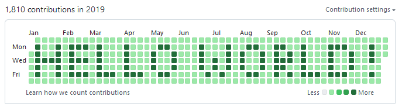
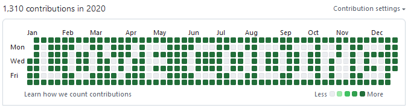

# git_asciitivity

Simple python script that aims to transform ASCII text in git activity.  
This allow you to deliver small messages through your GitHub/Gitlab activity.

# Prerequisite

You need 'python' installed and 'git' in your PATH.  
I use Python 3.11, but it may be OK with an older one or a more recent one.

# Getting Started

Run the python script 'git_asciitivity.py'.  
This script expects at least 3 arguments '--start_date', '--end_date' and '--text'.  
The format of the date is "Year-Month-Day".

Once executed (and if no error is returned...), you will have a git repository, named 'git_repo', generated beside 'git_asciitivity.py'.

You can then 'attach' this generated repo to your GitHub repo by doing the following commands:
```
git remote add origin https://github.com/<your repo url>.git
git branch -M main
git push -u origin main
```

# Results

Running the command below:
```
python git_asciitivity.py --start_date="2019-01-01" --end_date="2019-12-31" --text=" H E L L O   W O R L D  !" --nb_commit_background=1 --nb_commit_foreground=15
```

Generate this git activity on GitHub:



```
python git_asciitivity.py --start_date="2020-01-01" --end_date="2020-12-31" --text="  L O V E   C O D I N G" --nb_commit_background=5 --nb_commit_foreground=0
```

Generate this git activity on GitHub:



# Known limitations

Currently I only convert A-Z letters, space, and exclamation mark.  
So you will get a python error if you try other ASCII character (like numbers).
